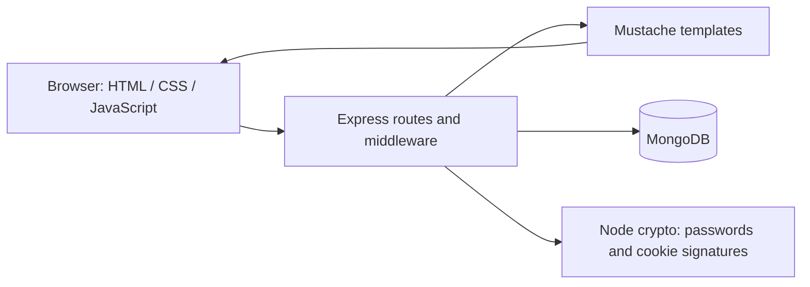

# Squeak! — Web Security Lab

A small messaging application built with Node.js, Express, MongoDB, and Mustache. Users create accounts, sign in, publish public **squeaks**, and send private **squeals** to another user. Developed as a web security coursework project, the application demonstrates validated database queries, signed sessions, password hashing, and recipient-based authorization.

The application source is in [`patched/`](patched/). This repository publishes the patched implementation, with local HTTPS and a loopback listening address by default.

## Features

- Account registration, sign-in, and sign-out.
- Public timeline and recipient-specific private inbox.
- User picker, message counter, and manual timeline refresh.
- Server-rendered pages enhanced with browser Fetch API calls.
- Patched implementation: salted scrypt password hashes, signed cookies, server-side session identity, CSRF checks, and validated message recipients.

## Architecture



The application runs as a single Node.js process. Express serves static assets and renders Mustache views; browser scripts call JSON endpoints and update the timeline. The server uses HTTPS using locally generated certificates. MongoDB stores accounts, sessions, and messages. No frontend build step or external authentication service is required.

```text
patched/
  patched_server.js       HTTPS server, routes, validation, sessions
  public/                Browser scripts and shared visual styling
  templates/             Login and timeline Mustache views
  .env.example           Safe configuration template
  package*.json          Dependencies and reproducible lockfile
docs/security.md         Security controls and known limitations
```

### Data model

| Collection | Patched document fields | Purpose |
| --- | --- | --- |
| `credentials` | `username`, `password: {salt, hash}` | Account authentication; unique username index |
| `sessions` | `id`, `username`, `createdAt`, `lastSeen`, `expiresAt`, `csrfToken` | Signed-cookie lookup, identity and expiration; unique ID index |
| `squeaks` | `name`, `time`, `recipient`, `squeak` | Public posts (`recipient: all`) and private messages; recipient index |

Collections are created by the application; no seed data is needed. The default database is `squeak_patched`.

## Local setup

Prerequisites: Node.js 22 or later, npm, a running local MongoDB instance on port 27017, and OpenSSL for generating a development certificate. Commands below use PowerShell from the project root.

1. Install dependencies and prepare local configuration:

   ```powershell
   Set-Location patched
   npm ci
   Copy-Item .env.example .env
   node -e "console.log(require('node:crypto').randomBytes(32).toString('hex'))"
   ```

   Put the generated random value after `APP_SECRET=` in `.env`. Keep that file private. The app requires a secret of at least 32 bytes and does not use a shared fallback.

2. Generate a new local certificate and private key:

   ```powershell
   New-Item -ItemType Directory -Force cert
   openssl req -x509 -newkey rsa:2048 -nodes -keyout cert/server.key -out cert/server.crt -days 30 -subj "/CN=localhost" -addext "subjectAltName=DNS:localhost,IP:127.0.0.1"
   ```

   The self-signed certificate produces a browser trust warning. Trust it only for this local development session, or use your own locally trusted development certificate. Certificate files are ignored by Git. HTTPS is required because the patched cookies use `Secure`.

3. Start the application:

   ```powershell
   npm start
   ```

   Open **https://127.0.0.1:3444**. Register an account, then use a second browser profile to register another account and try private messaging. `npm run dev` restarts the server when source files change. Stop with Ctrl+C.

### Configuration

`npm start` and `npm run dev` load the `.env` in the selected application directory through Node's built-in environment-file support.

| Variable | Default | Meaning |
| --- | --- | --- |
| `HOST` | `127.0.0.1` | Listening address |
| `PORT` | `3444` | Listening port |
| `MONGO_URL` | `mongodb://127.0.0.1:27017` | MongoDB connection URI |
| `DB_NAME` | `squeak_patched` | Application database |
| `APP_SECRET` | Required, no default | HMAC signing secret |

## HTTP interface

| Method | Route | Behavior |
| --- | --- | --- |
| GET | `/` | Login page or authenticated timeline |
| GET | `/session` | Authentication state and CSRF token |
| GET | `/users` | Usernames for the recipient picker |
| POST | `/signup` | Create account with `username`, `password` |
| POST | `/signin` | Authenticate with `username`, `password` |
| POST | `/signout` | Remove session and clear cookies |
| GET | `/squeaks` | Public timeline and current user's private inbox |
| POST | `/squeak` | Post `squeak` text with `recipient` (default `all`) |

The patched write endpoints require `x-csrf-token` (or `csrfToken` in the body). Sign-out and message endpoints also require authentication. Messages are trimmed and capped at 280 characters. Usernames must contain 3–20 letters, digits, dots, underscores, or hyphens; passwords must have at least eight characters and cannot contain the username.

## Validation and limitations

See [the security notes](docs/security.md) for implemented protections and remaining work. This is an educational portfolio project; production hardening remains future work.

For a manual smoke test, register two disposable users in separate profiles, post one public message and one private message, confirm the private message appears only in its recipient's inbox, and verify sign-out. In the patched app, confirm a missing CSRF token returns 403 and a modified session cookie does not authenticate. A message containing `</script>` should display as text.

## Publishing

The local `unpatched/` coursework directory, dependencies, `.env` files, TLS material, packaged archives, original reports, and attack screenshots are ignored. Only the patched application and its documentation are included in the publication files. The original coursework stays local because its binary contents and screenshots have not been cleared for publication. Dependency lockfiles and `.env.example` files should be committed.

Before the first push, rotate the database credential previously present in the original source and local connection-string file, and retire the old TLS key. Removing a credential from source does not revoke it. Review the staged file list and diff before committing. This folder originally had no Git metadata; if you publish through an existing repository, inspect that repository's history separately for old secrets.

```powershell
git init
git add .
git diff --cached --stat
git diff --cached
git commit -m "Prepare patched Squeak portfolio application"
git branch -M main
git remote add origin https://github.com/YOUR_USERNAME/YOUR_REPOSITORY.git
git push -u origin main
```

Create an empty GitHub repository first and substitute its URL. No license is asserted here: confirm the coursework's source ownership and redistribution terms before adding a license or republishing assignment materials.
